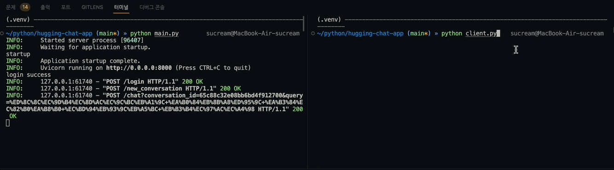

# HuggingChat 써보기
- HuggingFace의 [HuggingChat](https://huggingface.co/chat/) 테스트 해보기



## 사용법
1. `.env` 파일 생성 및 다음과 같이 로그인 이메일 및 패스워드 작성
```
LOGIN_ID=<Your ID>
LOGIN_PW=<Your PW>
```
2. FastAPI 서버 실행
```bash
python main.py
```

3. 브라우저 및 API 클라이언트에서 확인
   - `/login`: 로그인
   - `/new_conversation`: 새로운 대화 세션 생성
   - `/conversations`: 대화 세션 목록 확인
   - `/chat`: 대화하기

3.1. `client.py`로 API 호출
- 서버가 실행 중인 상태에서 다음 명령어를 실행하여 API를 호출할 수 있음
```bash
python client.py
```


## 라이선스
- 본 코드는 학습용으로 작성되었으며, 상업적인 용도로 사용할 수 없습니다.
- 본 코드는 다음 코드를 참고하여 작성되어 AGPL-3.0 라이선스를 따릅니다.
    - [Soulter/hugging-chat-api](https://github.com/Soulter/hugging-chat-api)